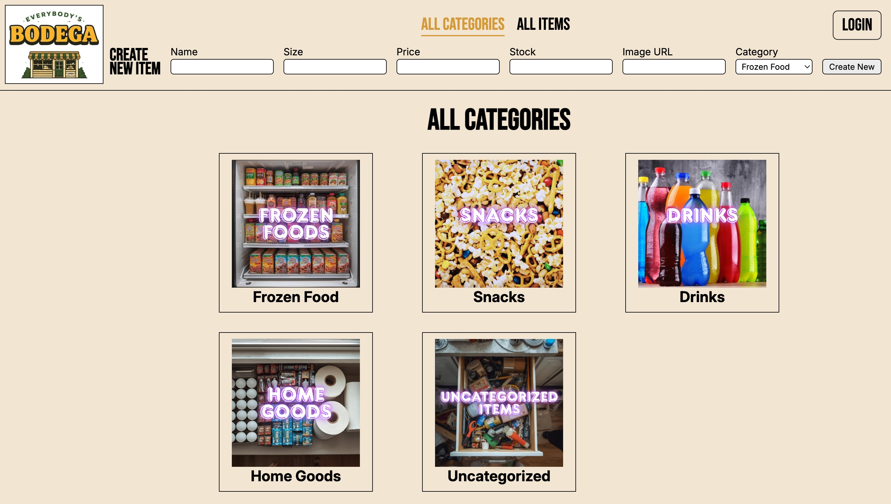

# Everybody's Bodega - Inventory Management System

A full-stack inventory management application for a corner store (bodega), built as part of [The Odin Project](https://www.theodinproject.com/) curriculum. The app allows store staff to browse inventory by category, view and edit item details, add new products, and delete items — all through a clean, server-rendered interface protected by session-based authentication.

---

## Screenshot



---

## Features

- **Category browsing** — View inventory organized by category (Frozen Food, Snacks, Drinks, Home Goods, Uncategorized)
- **All items view** — Browse the full inventory in a single list
- **Item detail pages** — View name, size, price, stock level, SKU, and product image
- **Add and edit items** — Forms with server-side validation for all fields
- **Delete items** — Confirmation step before deletion
- **Sorting** — Sort items by name, price, or stock level on any list view
- **Image support** — Product image URLs with an automatic placeholder fallback
- **Redirect-back navigation** — After actions, the app returns the user to their previous context
- **Session-based admin login** — All mutating actions (add, edit, delete) require authentication
- **Cross-category items** — Items can belong to multiple categories via a junction table

---

## Tech Stack

| Layer         | Technology                     |
| ------------- | ------------------------------ |
| Runtime       | Node.js                        |
| Framework     | Express 5.x                    |
| Database      | PostgreSQL                     |
| DB Client     | node-postgres (`pg`)           |
| Templating    | EJS 5.x                        |
| Validation    | express-validator              |
| Auth          | express-session, bcrypt        |
| Security      | helmet, express-rate-limit     |
| Utilities     | dotenv, method-override        |
| Module System | ES Modules (`import`/`export`) |

---

## Database Schema

The app uses three tables with a many-to-many relationship between items and categories.

```
┌─────────────┐       ┌──────────────────┐       ┌───────────────┐
│  categories │       │  item_categories  │       │     items     │
│─────────────│       │──────────────────│       │───────────────│
│ id (PK)     │──────<│ category_id (FK) │>──────│ id (PK)       │
│ name        │       │ item_id (FK)     │       │ name          │
└─────────────┘       └──────────────────┘       │ size          │
                                                  │ price         │
                                                  │ stock         │
                                                  │ image_url     │
                                                  │ sku (auto)    │
                                                  └───────────────┘
```

- **categories** — Store sections (e.g., Frozen Food, Snacks)
- **items** — Individual products with price, stock, size, image URL, and an auto-generated SKU
- **item_categories** — Junction table enabling items to belong to multiple categories

---

## Project Structure

```
bodega-inventory/
├── app.js                      # Express app entry point, session + helmet config
├── routes/
│   ├── indexRouter.js          # Homepage, login, logout routes
│   ├── itemsRouter.js          # CRUD routes for items
│   └── categoriesRouter.js     # Category browsing route
├── controllers/
│   ├── indexController.js      # Homepage, login, logout logic
│   ├── itemsController.js      # Item CRUD + validation
│   └── categoriesController.js # Category item listing
├── middleware/
│   └── auth.js                 # checkAuth — gates mutating routes
├── db/
│   ├── pool.js                 # PostgreSQL connection pool
│   ├── queries.js              # All SQL query functions
│   └── populatedb.js           # DB init and seed script
├── views/
│   ├── index.ejs               # Homepage — category grid
│   ├── categoryPage.ejs        # Items in a category
│   ├── allItemsPage.ejs        # All items list
│   ├── itemPage.ejs            # Individual item detail
│   ├── authUser.ejs            # Login page
│   ├── confirmDelete.ejs       # Delete confirmation
│   └── itemDeleted.ejs         # Post-deletion success page
├── partials/
│   ├── form.ejs                # Add/edit item form (rendered in header)
│   ├── formErrors.ejs          # Reusable form validation errors
│   ├── loginLogout.ejs         # Login/logout nav element
│   └── passwordErrors.ejs      # Reusable password error display
└── public/
    ├── images/                 # Static product images + placeholder
    └── scripts/                # Client-side JS (scroll position, etc.)
```

The app follows an **MVC pattern**: routes delegate to controllers, controllers call query functions, and query functions interact with the database via a shared connection pool.

---

## Installation & Setup

### Prerequisites

- [Node.js](https://nodejs.org/) (v18+)
- [PostgreSQL](https://www.postgresql.org/) (v14+)

### 1. Clone the repository

```bash
git clone https://github.com/housemouse62/bodega-inventory.git
cd bodega-inventory
```

### 2. Install dependencies

```bash
npm install
```

### 3. Create the database

```bash
psql -U postgres -c "CREATE DATABASE bodega_inventory;"
```

### 4. Generate a bcrypt password hash

The app stores the admin password as a bcrypt hash, not plaintext. Generate one in Node:

```bash
node -e "import('bcrypt').then(b => b.default.hash('your_password_here', 10).then(console.log))"
```

### 5. Configure environment variables

Create a `.env` file in the project root:

```env
DB_CONNECTION=postgresql://localhost/bodega_inventory
ADMIN_PASSWORD_HASH=your_bcrypt_hash_here
SESSION_SECRET=a_long_random_string_here
PORT=3000
```

| Variable              | Description                                              |
| --------------------- | -------------------------------------------------------- |
| `DB_CONNECTION`       | PostgreSQL connection string                             |
| `ADMIN_PASSWORD_HASH` | bcrypt hash of the admin password                        |
| `SESSION_SECRET`      | Secret used to sign the session cookie                   |
| `PORT`                | Port to run the server on (optional, defaults to `3000`) |

### 6. Seed the database

Run the population script to create tables and load sample data (42 items across 5 categories):

```bash
node db/populatedb.js
```

### 7. Start the server

```bash
node app.js
```

The app will be available at [http://localhost:3000](http://localhost:3000).

---

## Routes Reference

| Method | Path                           | Auth Required | Description                |
| ------ | ------------------------------ | ------------- | -------------------------- |
| `GET`  | `/`                            | No            | Homepage — all categories  |
| `GET`  | `/login`                       | No            | Login page                 |
| `POST` | `/login`                       | No            | Submit login credentials   |
| `POST` | `/`                            | No            | Logout                     |
| `GET`  | `/category/:id`                | No            | All items in a category    |
| `GET`  | `/items`                       | No            | All items                  |
| `POST` | `/items/new`                   | Yes           | Submit new item            |
| `GET`  | `/items/:id`                   | No            | Item detail page           |
| `GET`  | `/items/:id/confirmDeleteItem` | Yes           | Delete confirmation dialog |
| `POST` | `/items/:id/deleteItem`        | Yes           | Delete item                |
| `POST` | `/items/:id/edit`              | Yes           | Update item                |

**Sorting** is supported on list views via query parameters:

- `?sort=name&order=ASC` — sort by name ascending
- `?sort=price&order=DESC` — sort by price descending
- `?sort=stock` — sort by stock level

---

## Security

See [SECURITY.md](SECURITY.md) for a full breakdown of protections in place and any known gaps.

---

## Deployment

### Deploying to Railway

1. Push your code to GitHub
2. Create a new project on [Railway](https://railway.app) and connect your repo — Railway will auto-detect Node.js
3. In your project, add a **PostgreSQL** database: **New > Database > PostgreSQL**
4. In your web service's **Variables** tab, add:
   - `DB_CONNECTION` — set to `${{Postgres.DATABASE_URL}}` (Railway injects this from the database service)
   - `ADMIN_PASSWORD_HASH` — your bcrypt hash
   - `SESSION_SECRET` — a long random string
5. Set the start command to `node app.js` under **Settings > Deploy**
6. After the service is live, seed the database using the Railway CLI:

```bash
railway run node db/populatedb.js
```

---

## Future Enhancements

- **Category CRUD** — Add, edit, and delete categories (currently read-only)
- **Direct image uploads** — Allow file uploads instead of requiring an image URL
- **Search and filter** — Find items by name, price range, or stock level
- **Pagination** — Handle large inventories without loading all items at once
- **Low stock alerts** — Flag items below a configurable stock threshold
- **Bulk operations** — Import/export inventory via CSV

---

## Learning Outcomes

This project was built to practice and deepen understanding across the full stack:

### Backend & Architecture

- **RESTful routing** with Express — organizing routes by resource and HTTP method
- **MVC architecture** — separating routing, business logic, and data access into distinct layers
- **Relational database design** — modeling many-to-many relationships with a junction table
- **SQL with node-postgres** — writing raw parameterized queries, managing a connection pool, and understanding why parameterization prevents SQL injection
- **Server-side form validation** — using express-validator with custom error messages, re-rendered forms that preserve user input, and context-aware error handling across multiple page types
- **EJS templating** — rendering dynamic HTML with reusable partials, conditional rendering, and passing data from controllers to views

### Security

- **Session-based authentication** — login/logout with express-session, bcrypt password hashing, and auth middleware that gates all mutating routes
- **Web security fundamentals** — SQL injection prevention, XSS protection via EJS auto-escaping, open redirect defense, security headers with helmet, and rate limiting on sensitive endpoints
- **Security auditing** — learned to think through attack surfaces: what can an unauthenticated user do, what data is exposed, where is user input trusted without validation
- **CSRF awareness** — understanding cross-site request forgery and the tradeoffs of session cookie configuration

### Accessibility (WCAG)

- **Landmark regions** — using semantic HTML (`<main>`, `<header>`, `<nav>`, `<footer>`) so screen readers can navigate by structure
- **Skip navigation** — visually-hidden skip links that appear on focus for keyboard users
- **Focus management** — moving keyboard focus to the edit form when it appears, and styling `:focus-visible` states on all interactive elements
- **ARIA attributes** — `role="alert"` for form errors, `aria-current="page"` for active nav links, `aria-describedby` for associating error messages with form fields, `aria-label` for icon-only elements
- **Heading hierarchy** — understanding that headings create a navigable page outline and must nest in order
- **Table accessibility** — `scope="col"` on header cells, meaningful alt text on sort icons
- **Semantic HTML** — using `<dl>`, `<dt>`, `<dd>` for label/value pairs instead of headings, and understanding when an element's tag matters beyond its visual appearance
- **Keyboard navigation** — tabbing through the entire app to experience it as a keyboard user, and understanding the difference between hover and focus

### CSS & Frontend

- **CSS architecture** — organizing a stylesheet into logical sections, establishing consistent naming conventions, and consolidating duplicate rules into shared base classes
- **CSS specificity** — debugging why a selector wasn't applying and understanding how the cascade resolves conflicts
- **Hover and focus states** — building a consistent interactive design language using a defined color palette
- **CSS Grid and Flexbox** — laying out complex components like the table name cell and the sticky header
- **Attribute selectors** — using `[aria-current="page"]` as both an accessibility signal and a CSS hook, keeping markup and style in sync without extra classes
- **EJS and CSS debugging** — tracing rendering bugs from the browser back through the template to the controller, understanding how `<%= %>` vs `<%- %>` affects output

### Developer Mindset

- **Reading errors carefully** — tracing stack traces back to root causes rather than guessing at fixes
- **Thinking in contexts** — the same form renders in three different page contexts; handling all of them correctly required understanding the full data flow
- **Incremental testing** — working through form behavior systematically across all screens and submission states
- **Code as communication** — class names, function names, and file structure communicate intent to future readers

---

## License

ISC
